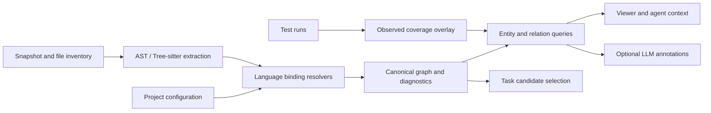

# Fleet graph: concrete implementation plan

**Scope changed after this research:** the user selected Python/Rust import-use
mapping first, with JS/TS retained and Go/Java deferred. See
[the short current guide](../fleet/GRAPH.md) and
[implementation validation](binding_results/SUMMARY.md). The broader roadmap
below is retained as research context, not the active implementation checklist.

Research date: 11 September 2026. This document specifies proposed changes; it does not claim they are implemented.

## Decision

Keep Fleet, Python AST, and Tree-sitter. Add explicit language-aware binding and module resolution behind a shared interface. Use one canonical graph to produce the viewer, agent context, imports, imported-by lists, and later task selection. Keep LLM annotations optional and separately identified.

The file → class → function hierarchy is a good navigation foundation. It cannot, by itself, resolve what an imported name denotes or tell which tests exercise a function. Those require binding resolution and execution evidence, respectively. Do not wait for a universally complete static call graph before developing tasks: define a supported capability set and make unresolved cases visible.

The screenshot is a useful conceptual target for containment/import/inheritance/call views and entity lookup; it is not a specification of language semantics or evidence that those relations are recoverable from syntax alone.

## 1. Evidence and what to reuse

The [existing audit](results/SUMMARY.md) scanned 13 repositories: 256 files, 2,740 symbols and 375 file-import edges. Fleet's 44 existing tests passed in that audit. Only 10/32 deliberately challenging capability fixtures and 7/15 source-checked questions passed. These fractions are not estimates of overall accuracy. The saved JSON discarded all 15,755 in-memory call records and 799 nonempty docstrings; the call records themselves also have ownership/duplication issues.

This follow-up inspected DGAT and AlphaStack source, researched upstream documentation, and ran [small isolated probes](research/probes.json). It did **not** run a comparative end-to-end DGAT/AlphaStack benchmark or invoke their LLM paths. The prior corpus included top-level `projects/glom` and `projects/pluggy`; the copies under `stress_stack` must be treated as separate snapshots.

| Project / mechanism | Useful idea | Limit found and Fleet decision |
|---|---|---|
| [DGAT dependency builder](/Users/adityagk/Desktop/capstone/DGAT/dgat.cpp:976) | Resolve source imports against a repository inventory; keep forward/reverse file relationships | Basename and suffix fallbacks select the first match, including iteration over unordered collections. Keep such matches as explicit search candidates, never confirmed dependencies. |
| [DGAT TS aliases](/Users/adityagk/Desktop/capstone/DGAT/dgat.cpp:1491) | Read project configuration for import paths | Stops at the first config, uses one target per alias, and does not implement full config scope/baseUrl/extends semantics. Build a project-context adapter instead of copying the fallback. |
| [DGAT ignore matcher](/Users/adityagk/Desktop/capstone/DGAT/dgat.cpp:1592) | A repository-owned exclusion file | Its simplified wildcard matching is not full Git semantics. Fleet already has `.fleetignore`; upgrade its path handling. |
| [DGAT inferred dependencies](/Users/adityagk/Desktop/capstone/DGAT/dgat.cpp:2298) | Optional explanatory enrichment | Resolving an LLM-proposed dependency to an existing file does not prove the dependency exists. Keep suggestions outside verified relations. |
| [AlphaStack dependency context](/Users/adityagk/Desktop/capstone/iteration-1_alpha_stack/src/utils/dependencies.py:375) | Small file context, incoming/outgoing views, bounded impact expansion | Useful agent interface. File importers must be called importers/dependents; they are not necessarily function callers. |
| [AlphaStack supplemental resolver](/Users/adityagk/Desktop/capstone/iteration-1_alpha_stack/src/utils/dependencies.py:476) | Deterministic fallback without a model | Isolated probes resolve flat Python and `.b`, but not a bare package-relative module, a configured `src` package, or a JS relative import. It only considers `.py` and `__init__.py`. This says nothing about DGAT resolving those cases earlier. |
| [AlphaStack cache construction](/Users/adityagk/Desktop/capstone/iteration-1_alpha_stack/src/utils/dependencies.py:250) | Precomputed lookup maps | Supplemental relationships enter one graph, but context caches are built from the original file tree/raw DGAT edges. Fleet should derive every view from the same final graph. Its supplemental traversal also does not apply `.dgatignore`. |
| [stress_stack symbol model](/Users/adityagk/Desktop/projects/stress_stack/src/stress_stack/symbols.py) | Scoped import bindings, aliases, signatures, source anchors and unresolved reasons | Port small concepts with regression fixtures; do not transplant its large graph/orchestration module. Rebuilding a graph with the same resolver verifies consistency, not semantic correctness. |

The new Tree-sitter experiments show concrete, local improvements:

- Go `type (A struct{}; B interface{})`: Fleet preserves only A; anchoring the capture on each `type_spec` preserves A and B.
- TypeScript interface, type alias and enum: Fleet omits all three in the fixture; dialect-specific queries extract all three.
- An optional alias capture matches both `foo` and `bar as baz` correctly. Blanket avoidance of `?` is unnecessary; capture cardinality needs testing.
- The installed Rust grammar exposes a function `body` field. Correct the contrary comment in `engine.py`; grammar claims should be version-tested.
- Fleet's basename-only ignore matching misses root-anchored, nested-path and `**` exclusions and cannot re-include a file with `!`.

Run these demonstrations with `fleet/.venv/bin/python graph_audit/research_probes.py`. They are small capability experiments, not an evaluation of whole-language precision.

## 2. Architecture and graph contract



Use ordinary Python records, JSON and dictionary indexes initially. A graph database is not necessary for this corpus. Preserve the existing parser dispatch; replace the claim that a new language needs *only* a query/spec with three declared levels: syntax extraction, module resolution, and symbol/reference resolution. A grammar can support the first without supporting the others.

Proposed organization, introducing modules only as their stage is implemented:

```text
fleet/src/fleet/graph/
  models.py            canonical records, schema version, serialization
  scan.py              orchestration only
  ignore.py            path/scoped exclusion rules
  inventory.py         file roles and project metadata
  snapshot.py          source/configuration fingerprints
  parser.py            backend dispatch
  pyast.py             Python lexical extraction
  engine.py            shared Tree-sitter query execution
  queries/             common and dialect-specific query files
  languages/           grammar/capability declarations
  resolve/             replaces resolve.py when split becomes necessary
    common.py          indexes, diagnostics, shared resolution interface
    python.py          Python modules, bindings, re-exports
    javascript.py      JS/TS project and module rules
    rust.py            Cargo targets and Rust modules
    go.py              Go modules and packages
    java.py            Java packages and source sets
  query.py             one implementation of forward/reverse/context views
```

The shared resolver contract is `build_context(inventory, configs)` and `resolve(file_facts, context) -> resolutions + diagnostics`. Language-specific semantics belong in adapters; query execution, serialization, IDs and indexes remain shared. Keep public `resolve_edges` compatibility while callers migrate.

### Records

| Record | Required information |
|---|---|
| Snapshot | Commit when available, dirty state, all included content hashes, metadata/ignore hashes, parser/query versions, active configuration, deterministic snapshot ID |
| File | Repository-relative path, language, content hash, role, parse status, diagnostics; retain isolated and empty source files |
| Definition | Snapshot-local ID, kind, name, qualified name, lexical parent, declaration/name/body byte spans, display line/column spans, signature source, docstring/comment source |
| Module/package | Language/project identity and member files; model packages separately where they are not one file |
| Import binding | Source statement span, module spelling, original/local names, containing scope, relative level where applicable, import form and conditional/type-only context |
| Reference | Original expression and span, lexical scope, enclosing callable when applicable, reference kind, receiver if present |
| Resolution | Reference/binding ID, outcome, target(s), method, evidence spans, relevant configuration and explicit assumptions |
| Diagnostic | Stage, file/span, reason, severity, supported/unsupported capability; machine-readable and visible in queries |

Store original source text where needed rather than reconstructing imports and losing aliases. Documentation extracted from source is not an LLM summary. Python AST columns are UTF-8 byte offsets; specify that unit and test Unicode when deriving absolute byte spans and display columns.

IDs must be unique within a snapshot. Include kind, qualified scope and byte-span discriminator where necessary; line number alone fails same-line overloads. Use `(snapshot_id, entity_id)` across graphs. Cross-revision entity matching is a separate future feature; do not imply IDs survive moves/edits unchanged.

Use one node per definition, with separate relations:

- `contains`: lexical ownership, including nested definitions.
- `member_of`: Go receiver/type membership and package membership where lexical containment differs.
- `imports_module`, `binds_symbol`, `reexports`: distinguish module dependency from an imported declaration.
- `inherits`, `implements`: distinguish class bases from interface/trait implementation.
- `invoke`, `references`: resolved callable and other symbol references; retain unresolved reference records too.
- `covers`: later, observed test execution tied to a particular run/environment.

Derive file-import edges as a compatibility projection. A Go import targets a package; do not fabricate an import to every source file in that package. Resolved package-qualified references can subsequently identify a definition in a particular file.

Resolution outcomes should include `resolved`, `ambiguous`, `unresolved`, and `unsupported`, with target classification/reasons such as external dependency, ignored source, missing project context, dynamic expression or syntax error. A resolved module can coexist with an unresolved imported symbol. A bare module name that failed local resolution is not automatically a known external package. Avoid arbitrary numeric confidence scores presented as probabilities.

## 3. Ordered implementation slices

Each slice should preserve working capabilities, add focused regression cases, and update the capability matrix. Do not introduce every abstraction before the first working vertical slice.

### Slice 1 — Preserve evidence and make output honest

**Files:** `models.py`, `scan.py`, `parser.py`, `engine.py`, `fleet/viewer.html`.

- Introduce schema `0.3.0`; serialize docstrings, call/reference records, aliases, empty/partial parse status and diagnostics. Add an explicit source span contract.
- Record the snapshot/configuration fingerprint from the start, before adding caches.
- Make the viewer accept 0.2 as legacy with unavailable fields marked unknown. Reject unsupported future schemas clearly; do not interpret missing calls as zero calls.
- Index import statements by binding/span with a list of resolutions, replacing the viewer's line → single edge map.
- Replace the unconditional `package` label for unresolved imports. Show “No incoming imports resolved” and relevant incomplete-resolution diagnostics.
- Make parser/query failures distinguishable. A grammar mismatch, missing grammar, query limit and malformed source are different states.

**Acceptance:** JSON round-trip retains source documentation and reference evidence; multiple imports on one line are visible; all old fixtures still work; old graphs open with a legacy notice. Saved-source hashes detect changes before returning a code span.

### Slice 2 — Inventory and `.fleetignore`

**Files:** `ignore.py`, new `inventory.py`, `scan.py`, CLI configuration and documentation.

Use `pathspec.GitIgnoreSpec` as the matching component, with Fleet responsible for directory traversal and scoped precedence. Git's rules include anchoring, negation and special `**` behavior; a matcher alone does not implement traversal. [Git rules](https://git-scm.com/docs/gitignore), [PathSpec API](https://python-path-specification.readthedocs.io/en/latest/readme.html).

Choose this policy explicitly:

1. Hard exclusions: `.git` internals and the active Fleet output/cache directory, including output nested under the scan root.
2. Configurable built-in defaults for environments, generated artifacts and vendored dependencies.
3. Repository `.gitignore` files, scoped by directory, enabled by default with a `--no-gitignore` escape hatch. Do not depend on the machine's global Git excludes or private `.git/info/exclude`.
4. Root `.fleetignore` overrides those soft rules; nested `.fleetignore` support can be deferred and documented. Explicit CLI include/exclude rules apply last among soft rules.

Negation follows Git's parent-directory restriction: reopen an excluded parent before including a child. When a higher-priority rule reopens a directory, do not prune it based on a lower-priority rule alone. Record rule source and pattern for exclusions. Do not auto-create `.fleetignore` during a read scan; offer an explicit init command if wanted.

Keep tests by default. File roles (`source`, `test`, `generated`, `vendor`, `configuration`) and task eligibility are separate from parse inclusion. A declaration file needed for navigation can be indexed yet excluded from patch-task candidates. Keep required project manifests/configuration available even when dependency source directories are excluded; use a small documented metadata allowlist and record that exception.

Detect extension and the requested language **before** reading/parsing source. Bound file size with an explicit skipped diagnostic. Do not follow symlinks outside the repository by default; report that choice. Keep all scanner and adapter discovery on the same inventory so supplemental passes cannot resurrect ignored files.

**Acceptance:** fixtures for root paths, nested paths, `**`, negation, escaped `#`/`!`, nested `.gitignore`, reopening directories, ignored targets, symlinks and user overrides. Compare pure Git-compatible fixtures to `git check-ignore --no-index` in disposable repositories; separately test Fleet precedence. No parsing of excluded dependency trees, and test files remain available.

### Slice 3 — Correct extraction and scope ownership

**Files:** `pyast.py`, `engine.py`, `parser.py`, `.scm` files, language specs.

- Python: use one recursive scope-aware visitor; index nested and conditional functions/classes. Assign each call to its actual scope once. Function defaults/decorators execute in their enclosing context; a nested `yield` does not make its outer function a generator.
- Retain full callee expressions (`self.render`, `rpc.NewServer`), signatures and import aliases. Do not strip receivers down to an unqualified method name.
- Tree-sitter: retain grouped `QueryCursor.matches`; anchor each entity on its own node. Include callable scopes and distinguish lexical from semantic parents. Deduplicate overlapping patterns by entity identity/kind with explicit precedence, not just a shared parent span.
- Fix Go grouped type capture. Add TS/TSX type definitions using a common JS query plus dialect-specific queries; keep TSX's separate grammar.
- Represent Rust `impl` context explicitly and emit type/trait implementation relations, rather than attaching a trait base to every method.
- Fix same-line overload IDs and test UTF-8, multiline decorators, anonymous callbacks and empty declarations.
- Replace silent query-pattern dropping with explicitly compiled supported queries. CI fails any supported grammar/query incompatibility; an interactive scan may return partial output with a visible diagnostic.

**Acceptance:** corresponding existing capability gaps pass, caller ownership has no nested-call duplication, a query containing optional aliases handles aliased/unaliased imports, all supported queries compile for the locked grammar set, and source with ERROR/MISSING nodes is marked partial.

### Slice 4 — Python resolution: first complete vertical slice

**Files:** resolver adapter, project metadata extraction, graph indexes; integration corpus `glom`, `pluggy`, Fleet itself.

- Build module identities from explicit configured roots and supported packaging metadata, including common `src` layouts. If roots are inferred, record the rule; conflicting roots produce ambiguity rather than first-match behavior. Never execute `setup.py` or import target code during static scanning.
- Resolve relative imports using the containing package. Preserve one binding per name for `from pkg import a, b`.
- Follow explicit `__init__.py` re-exports with cycle detection. Resolve package attributes before assuming every imported name is a submodule. Track literal `__all__` where available; dynamic exports remain unresolved. Handle namespace-package portions conservatively with configured roots.
- Build lexical binding lookup for imported aliases, local declarations and shadowing. Delete the global unique-bare-name inheritance fallback, which can join unrelated or cross-language classes.
- Resolve direct function references and imported aliases when the binding is supported. Treat uncertain receiver dispatch, monkey-patching, local reassignment and dynamic import expressions as candidates/unknowns with evidence.

The implementation should follow the distinction between loading a module and binding a name in the [Python import reference](https://docs.python.org/3/reference/import.html).

**Acceptance:** public Pluggy imports reach `src/pluggy`; Fleet can resolve its own source-root imports; aliases and explicit re-exports reach their declarations; multi-name imports retain every binding; nested definitions are queryable; unrelated external bases and duplicate module names never acquire invented confirmed edges.

**First checkpoint:** `get_entity`, `get_imports`, `get_imported_by` and `get_references` answer the selected Python questions from saved JSON. This is the first graph version to give an agent for a focused usefulness experiment.

### Slice 5 — JS/TS resolution, then bounded Go/Rust/Java support

Prioritize JS/TS next because the existing corpus already exercises it. Other languages receive explicit capability levels, not a blanket “fully supported” badge.

| Adapter | Initial supported behavior | Explicit limits |
|---|---|---|
| JS/TS | Relative modules, named/default/namespace aliases, re-exports, literal `require` and literal dynamic imports; nearest applicable project configuration; config `extends`, `baseUrl`, exact/wildcard `paths` and ordered fallbacks; workspace packages | Keep type-only and runtime resolution distinct. Package exports/imports conditions and extension substitution depend on resolution mode. Unsupported configuration is diagnosed, not guessed. |
| Go | `go.mod`/workspace module identities, directory packages and file membership, import aliases, package-qualified definitions, receiver membership across files | Record build tags/GOOS/GOARCH context. Unknown active build configuration gives candidate sets. Interface satisfaction needs method-set/type analysis; syntax alone cannot assert it. |
| Rust | Cargo package/library/binary/test-target context; `mod` declarations, inline modules, `crate/self/super`, explicit/grouped `use`, aliases and re-exports; recorded `#[path]`/`cfg` context | A Cargo package can contain several crates. Macros, conditional modules and inferred receiver types may remain unresolved. Integration-test crate imports must use Cargo identity, not directory suffixes. |
| Java | Package declarations, source sets, explicit/static/wildcard imports with scoped candidates, overloaded declarations with unique IDs | Full overload selection, classpath semantics and generated sources are deferred to a semantic provider when needed. Add a real Java corpus before claiming integration quality. |

These rules must follow language/project semantics, not one dotted-path resolver. TypeScript documents `paths` precedence and distinguishes compiler resolution from emitted runtime paths; Go imports packages; Rust has module declarations that establish its module structure. [TypeScript modules](https://www.typescriptlang.org/docs/handbook/modules/reference.html), [Go modules](https://go.dev/ref/mod), [Rust modules](https://doc.rust-lang.org/reference/items/modules.html).

**Acceptance:** FlappyBird `GameSnapshot` is indexed; imported types reach their declarations; `render → clearCanvas` is exposed with the receiver-resolution method/assumptions. Add TS monorepo duplicate-alias fixtures and missing-mode diagnostics. TinyGoRPC's package-qualified call reaches the right definition; tiny-rpc's same-package relations do not require fabricated file imports. Rust integration tests resolve the library crate. Every supported case has an ambiguity/negative counterpart.

### Slice 6 — Agent queries, historical snapshots and measured usefulness

**Files:** `query.py`, viewer, snapshot/cache layer and audit harness.

Expose a small tool surface: `find_entity`, `get_entity`, `get_imports`, `get_imported_by`, `get_references`, `get_callers`, `get_impact`. Every result includes snapshot identity, evidence, resolution status and pagination. Incoming indexes are derived from the same canonical resolved relations as outgoing ones; they are not separately inferred. Keep importers and callers separate.

Return a bounded subgraph: exact names/IDs first, then lexical search over names/signatures/docs, then relevant neighbors. Include snippets on demand with hash validation. Use depth/result/token limits and report truncation; no need to dump a whole graph into a prompt. Add BM25 only if exact/lexical search misses measured retrieval needs.

For a historical task, create the solver-visible graph from its actual starting checkout and allowed files. Re-read package manifests, lockfiles, source roots and ignore rules there. A current-HEAD graph cannot safely describe a historical base. Keep gold patches, future source and hidden tests out of solver-visible indexes and LLM summaries. Validator-only coverage on gold code belongs to a separate graph/run overlay.

Cache extracted facts by content + grammar/query/extractor hash. Key resolution by facts + project/ignore/configuration identity. Detect deleted files and configuration-only changes, rebuild affected indexes, and invalidate reverse relationships. First use whole-snapshot rebuilds; optimize only after timing them. Tree-sitter incremental parsing does not automatically maintain repository dependencies.

**Acceptance:** repeat scans produce the same canonical graph after excluding run metadata/absolute root; deletion and config-only tests remove stale edges; two historical snapshots with different roots/dependencies stay isolated; no gold-only symbol appears in solver output. All context APIs agree on incoming/outgoing relations.

## 4. Tree-sitter decisions grounded in the library

The installed baseline is `tree-sitter 0.26.0` and `tree-sitter-language-pack 1.16.2`, verified by the probes. Pin a tested dependency set and record grammar/query fingerprints; do not upgrade during this refactor simply to follow the latest release. The current upstream language-pack describes grammar delivery/caching capabilities that must not be assumed identical to this installed version. [Language-pack upstream](https://github.com/xberg-io/tree-sitter-language-pack).

Queries identify syntax and named spans. Definitions/references/doc captures are useful conventions, not an automatic cross-file resolver. Optional and repeated captures are supported; consume their cardinality correctly. Grammar `node-types.json` can inform fixture generation and field assertions. Local-scope captures still require a consumer that interprets language semantics. [Code navigation](https://tree-sitter.github.io/tree-sitter/4-code-navigation.html), [query operators](https://tree-sitter.github.io/tree-sitter/using-parsers/queries/2-operators.html), [static node types](https://tree-sitter.github.io/tree-sitter/using-parsers/6-static-node-types.html), [local scopes](https://tree-sitter.github.io/tree-sitter/3-syntax-highlighting.html).

Record parse ERROR/MISSING nodes and query execution limits. Cache compiled queries by grammar identity plus query content, not language name alone. Tree edits/changed ranges are useful later for incremental extraction, but module configuration and reverse dependencies need their own invalidation. [QueryCursor API](https://tree-sitter.github.io/py-tree-sitter/classes/tree_sitter.QueryCursor.html), [Tree API](https://tree-sitter.github.io/py-tree-sitter/classes/tree_sitter.Tree.html).

This is a review of the Tree-sitter capabilities relevant to Fleet, supported by local experiments; it is not an exhaustive audit of the library's implementation.

## 5. Related projects: borrow selectively

| Project | Relevant lesson | Adoption decision |
|---|---|---|
| [Aider repo map](https://aider.chat/docs/repomap.html) | Ranked repository context under a token budget | Borrow bounded context selection after relation correctness. A useful map is not a proof of complete resolution. |
| [SCIP](https://github.com/scip-code/scip/blob/main/README.md) | Language-neutral semantic indexing with definitions/references/implementations | Reserve an optional importer interface for a supported compiler/indexer. Use when accuracy requirements justify environment setup; do not make all scans require it. |
| [CodeGraphContext](https://github.com/CodeGraphContext/CodeGraphContext/blob/main/README.md) | Tree-sitter navigation plus optional SCIP-based semantic indexing | Reference for hybrid capabilities and agent queries. Do not adopt its entire storage/server stack without a measured need. |
| [Tree-sitter graph](https://github.com/tree-sitter/tree-sitter-graph/blob/main/README.md) | A DSL for creating graphs from syntax | Useful design reference; it does not remove the need to implement language resolution rules. Keep Fleet's existing Python extractor for now. |
| [GitHub stack graphs](https://github.com/github/stack-graphs) | Scoped, incremental name-resolution architecture | Study the model. The repository was archived on 9 September 2025 and says GitHub no longer supports it; avoid making it a new core dependency. |
| [Repo2RLEnv](https://github.com/huggingface/Repo2RLEnv/blob/main/docs/pipelines/pr_runtime.md) | Runtime-verified PR tasks with separate fail-to-pass/pass-to-pass sets and explicit validation metadata | Reference the environment/task boundary later. Its existence does not establish that Fleet needs a complete graph before the first task, or validate Fleet's graph. No comparative runtime benchmark was run here. |

## 6. Validation gates and the LLM experiment

Use four independent questions, rather than graph size as a success metric:

1. **Did extraction preserve the source facts?** Fixtures check names, scope, aliases, exact spans, docs and serialization. Maintain the existing 32 capability cases; move each to the regression suite when its capability ships.
2. **Are targets right?** Hand-label positive, negative and ambiguous references independently of the resolver. Report resolved-target precision, eligible-reference recall, unresolved reasons and denominators per language/relation. An external import is not a missing internal edge; a package-level resolution is not a symbol-level success. Keep the existing 15 source questions and add held-out cases not used while fixing code.
3. **Does the tool help an agent?** Compare source search alone, source search + deterministic graph, and source search + graph + LLM summaries under the same model, task set and context budget. Measure target recall@k, wrong factual answers, solve outcomes, tokens, latency and total cost. Include a language/repository holdout; a small development set is not a general benchmark.
4. **Is the generated task verifiable?** This remains a separate runtime gate. Reproduce the starting environment; apply the verifier tests consistently before/after the fix; require a real fail-to-pass signal and a passing gold patch; preserve a meaningful regression set and repeat suspected flaky cases. Import/collection failures caused by broken setup do not establish the intended bug. Separate assertion failures from skipped/error/uncollected tests.

For the first supported Python/TS release, require all promised curated cases to pass and no known incorrect confirmed edges. Extend the source review to at least 50 stratified reference sites per supported language before reporting even preliminary accuracy rates; publish the counts and sampling method. Recheck graph structural invariants, but do not mistake valid endpoints for valid semantics. Later Go/Rust/Java releases meet the same gate for their declared capability sets.

Coverage should be collected per test and bound to snapshot/environment/run, then mapped to definitions. It shows executed code, not whether assertions are adequate. For task validation, add targeted mutation checks or property-based tests where the function's contract supports them; require tests to reject intentionally wrong plausible implementations. Generated tests need independent checks and cannot serve as the sole authority for their own correctness.

LLM enrichment is a separate, on-demand annotation layer: explain responsibility, summarize source evidence and help natural-language retrieval. Keep source docstrings intact. Store model/prompt versions, source and dependency-context hashes, evidence spans and the generation time. Do not promote a model's suggested call/import edge into a confirmed static fact. Only expose task-start information to solver-visible enrichment.

Do not build whole-repository summaries before this comparison. If summaries do not improve retrieval or task outcomes enough to justify their cost, omit them.

## Recommended next work item

Implement slices 1–4 as the first milestone: evidence-preserving JSON, shared inventory/ignore rules, correct scopes, and Python bindings. Deliver an agent-readable graph on glom and pluggy with reliable imports/imported-by queries and honest unresolved states. Keep TS query corrections in slice 3; deliver full TS resolution in the following slice.

The main simplification is one source of graph truth with small language adapters. Reusing DGAT's useful interface ideas does not require inheriting its LLM dependency inference, whole-file CLI parsing, permissive filename matching, or AlphaStack's duplicated cache paths.
